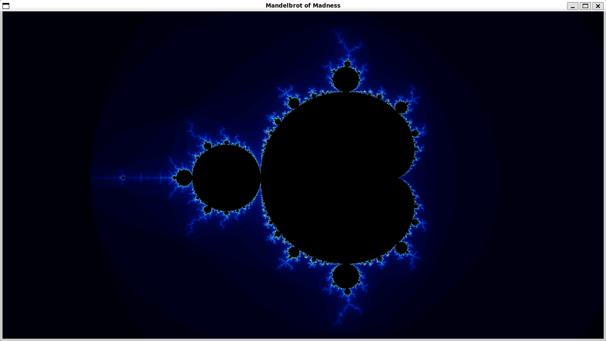
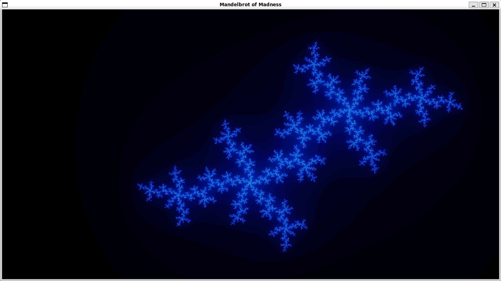

# Mandelbrot of Madness

Soal ini berisi tentang implementasi pembuatan gambar fraktal **Mandelbrot** dari tiga versi. Adapun implementasi bonus fraktal **Julia** dilakukan hanya di GPU bersama dengan bonus GUI.

1. **Serial** – Penggambaran dilakukan menggunakan satu *thread* CPU secara berurutan.
2. **Paralel** – Penggambaran dilakukan menggunakan beberapa *thread* CPU.
3. **GPU (CUDA)** – Penggambaran dijalankan pada GPU untuk memaksimalkan paralelisme (dalam hal ini dilakukan pada lingkungan WSL).  

---

## Struktur Program
Seluruh implementasi diletakkan pada satu program, yang akan menghasilkan tiga gambar yang berbeda pada *runtime*. Berikut adalah struktur program pada soal ini:

```
Soal 4/
├── main.cpp             # Implementasi serial, paralel CPU, dan GUI.
├── gpu.cu               # Implementasi paralel GPU dan Julia, yang juga akan dipanggil oleh main.cpp.
├── stb_image_write.h    # Header dari repository https://github.com/nothings/stb
├── media/               # Untuk readme.md
└── output/              # Folder gambar
```

---

## Cara Kompilasi

## Bagian 1: Penyiapan WSL 2

Untuk menjalankan program, dibutuhkan lingkungan WSL 2.

1. **Instalasi WSL pada Powershell**
   ```powershell
   wsl --install
   ```

2. **Instalasi Ubuntu**  
   Lakukan *restart* dan selesaikan instalasi.

3. **Verifikasi Versi WSL**
   ```powershell
   wsl -l -v
   ```
   Pastikan `VERSION` untuk Ubuntu adalah `2`. Jika tidak:
   ```powershell
   wsl --set-default-version 2
   ```
---

## Bagian 2: Penyiapan Dependensi
1.  **Instal Driver NVIDIA**: Pastikan driver NVIDIA kompatibel dengan WSL sudah terinstal.  
    Unduh dari https://www.nvidia.com/en-us/drivers/

2. **Buka Terminal Ubuntu**

3. **Update Sistem & Instal Build Tools**:
    ```bash
    sudo apt update && sudo apt upgrade -y
    sudo apt install build-essential git -y
    ```

4. **Instal CUDA Toolkit di Ubuntu**:
    - Toolkit dapat di-*download*: https://developer.nvidia.com/cuda-downloads 
    Pilih: Linux > x86_64 > WSL-Ubuntu > 2.0 > deb (local).
    - Jalankan semua perintah instalasi yang diberikan.

5. **Atur PATH untuk CUDA** (ganti `13.0` dengan versi yang diinstal):
    ```bash
    echo 'export PATH=/usr/local/cuda-13.0/bin${PATH:+:${PATH}}' >> ~/.bashrc
    echo 'export LD_LIBRARY_PATH=/usr/local/cuda-13.0/lib64${LD_LIBRARY_PATH:+:${LD_LIBRARY_PATH}}' >> ~/.bashrc
    source ~/.bashrc
    ```

6. **Verifikasi Instalasi**:
    ```bash
    nvcc --version
    ```

7. **Instal Library SFML**
    ```bash
    sudo apt install libsfml-dev -y
    ```

---

## Bagian 3: Kompilasi

1. **Unduh Kode Sumber**
    ```bash
    git clone https://github.com/ITBAtharizza/18223079_Seleksi-Bagian-B_Lab-Sister.git
    cd 18223079_Seleksi-Bagian-B_Lab-Sister/"Tahap 1/Soal 4"
    ```

2. **Kompilasi Program**
    ```bash
    nvcc main.cpp gpu.cu -o mandelbrot -arch=sm_XX -Xcompiler "-fopenmp" -lsfml-graphics -lsfml-window -lsfml-system
    ```
    > **Catatan:** Ganti `-arch=sm_XX` dengan arsitektur GPU yang sesuai.  
    > Dapat dilihat pada https://developer.nvidia.com/cuda-gpus dan menghapus . di tengah (contoh: 8.6 -> sm_86)

3. **Eksekusi Program**
    - **Resolusi default (1280x720)**:
      ```bash
      ./mandelbrot
      ```
    
    - **Resolusi kustom (contoh: 4K)**:
      ```bash
      ./mandelbrot 3840 2160
      ```
    
---

## Hasil Benchmarking

Pengujian dilakukan pada 5 resolusi berbeda. Waktu eksekusi diukur dalam **detik** dan **speedup** dihitung relatif terhadap versi serial.

| Resolusi | Serial (s) | Paralel (s) | GPU (s) | Speedup CPU | Speedup GPU |
|----------|------------|-------------|---------|-------------|-------------|
| 720p     | 1.038      | 0.152       | 0.071   | 6.829×      | 14.715×     |
| 1080p    | 2.342      | 0.305       | 0.148   | 7.688×      | 15.802×     |
| 1440p    | 4.243      | 0.590       | 0.228   | 7.192×      | 18.626×     |
| 4K       | 10.020     | 1.299       | 0.446   | 7.255×      | 21.090×     |
| 8K       | 39.120     | 5.399       | 1.413   | 7.245×      | 27.682×     |

#### Keterangan: Penggunaan GPU mungkin dipengaruhi oleh aplikasi *background* dan kondisi *hardware* seperti suhu atau daya.
---

## Dokumentasi
### Mandelbrot


### Julia


### Demonstrasi Program
#### [18223079_Mandelbrot](https://youtu.be/SIhnojlHMzw)
---

## Catatan
- Penggunaan GPU akan semakin terasa semakin resolusinya meningkat.
- Paralel CPU juga memberikan peningkatan konsisten tetapi terbatas oleh jumlah core prosesor.
- Semua hasil pengujian dilakukan pada mesin dengan spesifikasi:
  - CPU: Intel Core i5-12450H (8 core, 12 thread)
  - GPU: NVIDIA GeForce RTX 3050 Laptop GPU
  - RAM: 16GB
  - OS: WSL Ubuntu 24.04.01 LTS
